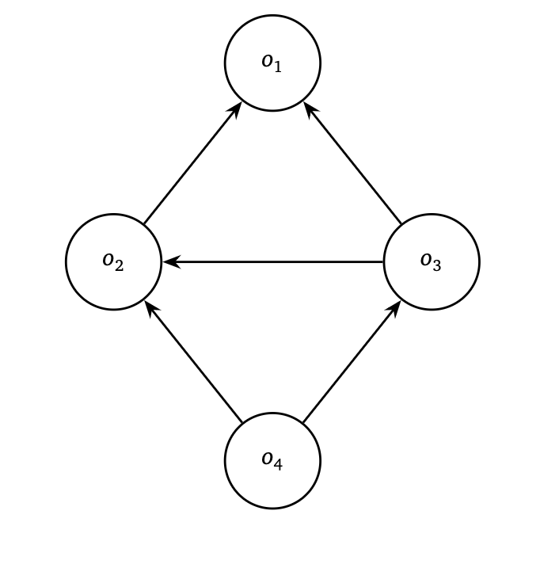

# IndustryDAG

This project implements a C++ data structure to manage the production of items in a simplified industry. Items can be either basic (elementary resources) or composite (built from other items). Dependencies between items are modeled using a Directed Acyclic Graph (DAG).

This project was developed as part of **Lab 10 of the "Algorithms and Data Structures" (ASD) course, University of Genoa – Academic Year 2024/2025**.




## Features

The system allows you to:

* Create an empty industry.
* Add new items:

  * **Basic items**, which have no dependencies and finite stock.
  * **Composite items**, defined by a set of required components.
* Check whether an item exists.
* Remove an item and recursively remove all items that depend on it.
* Increase or decrease the quantity of a basic item.
* Retrieve direct and indirect dependencies:

  * `listNeed`: items needed to produce a given item.
  * `listNeededBy`: items that directly depend on a given item.
  * `listNeededByChain`: all items that depend (directly or indirectly) on a given item.
* Calculate how many units of a target item can be produced based on the available stock of basic items.

## Data Structure

The dependency system is represented as a **Directed Acyclic Graph (DAG)**:

* Each node (`vertexNode`) represents an item.
* Each directed edge (`halfEdgeVertex`) points to a required component.
* Items are stored in a dynamic array with automatic resizing.
* Adjacency lists are implemented as linked lists per node.
* A custom array-based list structure (`list-array.h/.cpp`) is used instead of STL containers, as required by the course.

## Files

* `industry.cpp`, `industry.h`: Core data structures and algorithms.
* `list-array.cpp`, `list-array.h`: Custom list implementation used throughout the project.
* `main.cpp`: A comprehensive test suite covering over 200 scenarios.
* `asd-lab10.pdf`: The official lab assignment (Italian).
* `lucidi-labo-ind-25.pdf`: Implementation report explaining design choices.

## Compilation

Compile using the following command:

```bash
g++ -Wall -std=c++11 industry.cpp list-array.cpp main.cpp -o industry
./industry
```

## License

This project is licensed under the **MIT License**. See the `LICENSE` file for more details.
